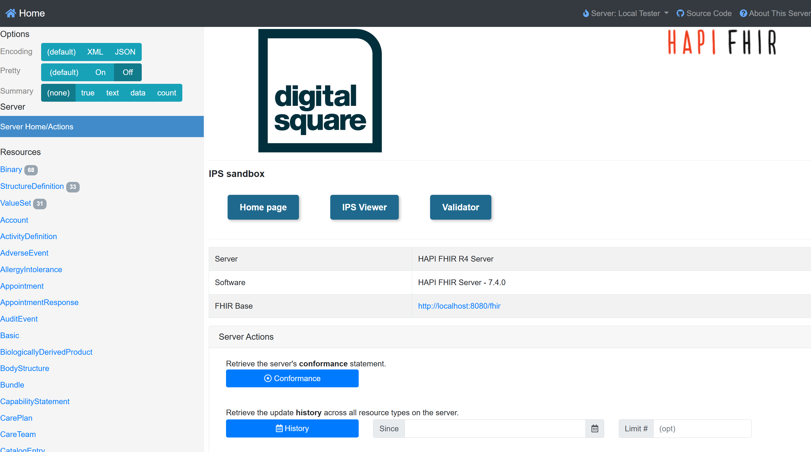

## Server 
---

Using the FHIR IPS specification in a lab or sandbox setting is a great way to get familiar with what the IPS is and isn't meant for.
In this repository we also include a FHIR Server preconfigured with a few IPS enabler features:
* Fully working FHIR server with the IPS conformance artefacts uploaded
* A Validator frontend for ease of use by non-technical people
* Sample content
* A simple IPS viewer for displaying an IPS content in a simpler, more friendly way.

These features are growing (with your help - please feel free to contribute) and are meant to enable developers, analysts and innovators to focus on building upon the IPS. 

## Running the server
The IPS sandbox has all the features included. To use it, simply get the files in the [`ips-server`](link.html) folder and run `docker compose up`. You'll see the server landing page on `http://localhost:8080` or another URL you may have selected. 

 

Feel free to clone and adapt and provide feedback to our community.

